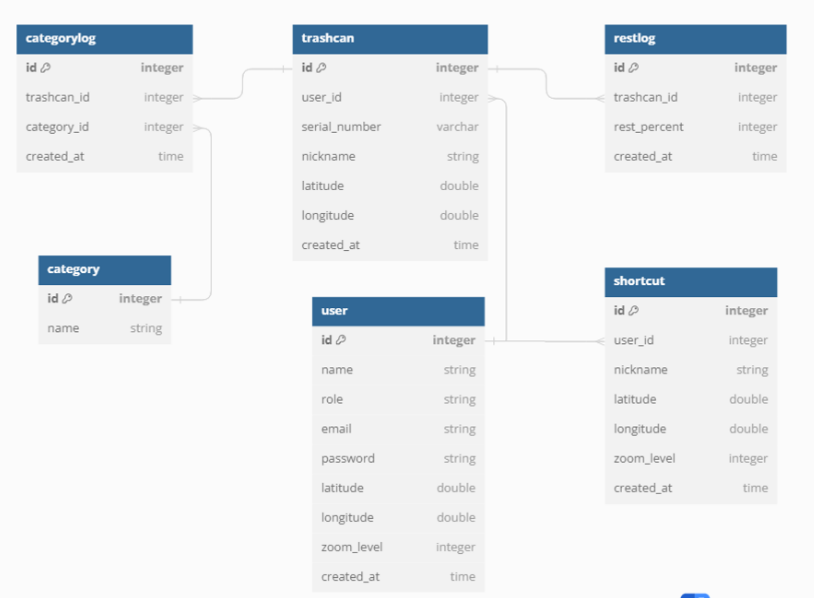
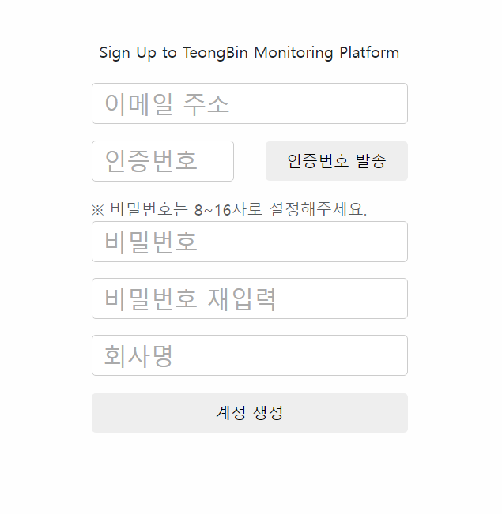
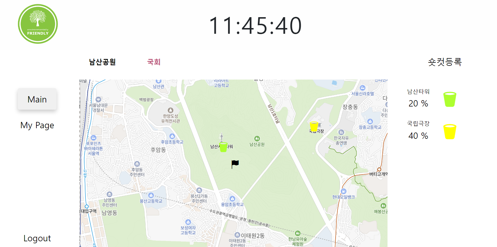
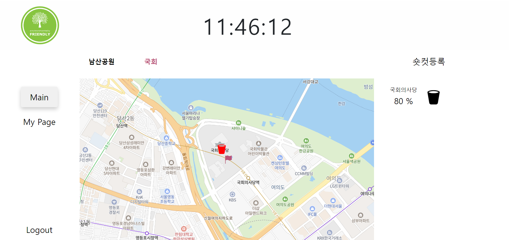
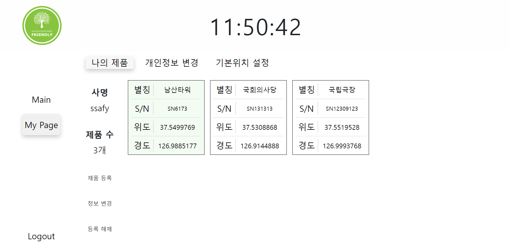
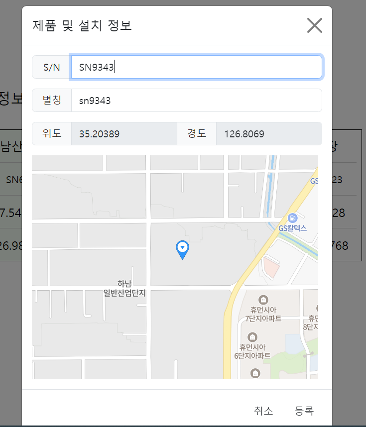
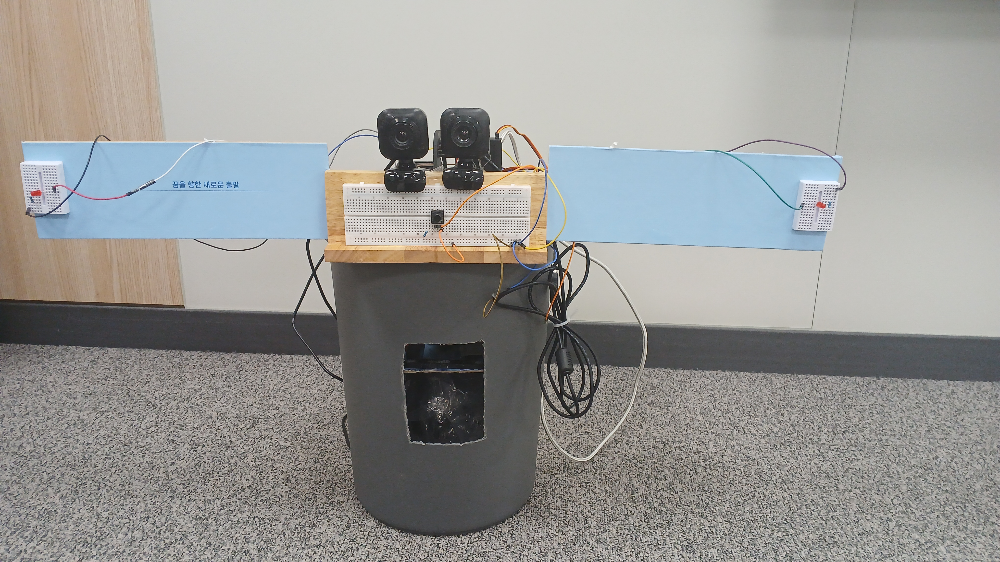
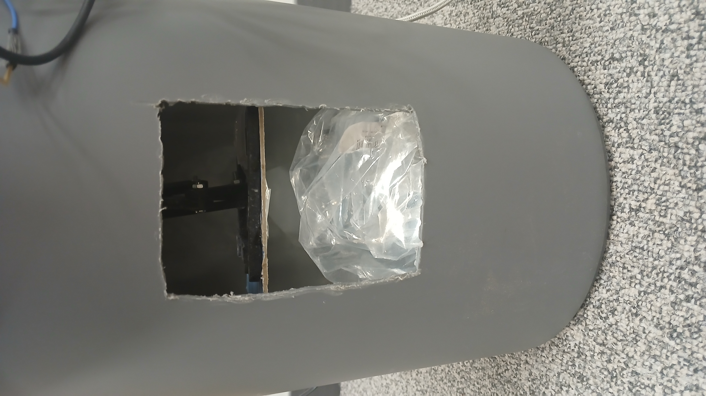
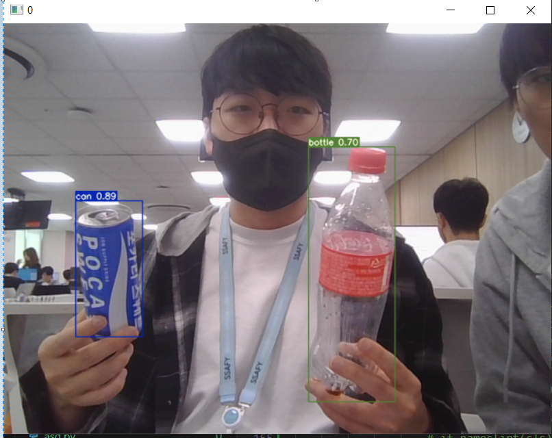

# 1. 프로젝트 텅 빈 

## 주제

- 프레스 기능과 재활용 분류 모델을 이용한 스마트 쓰레기통

## 기간

- 2024.07.09 ~ 2024.08.16(6주)

## 팀원 역할 및 담당

| 지예찬 | 황우성 | 김민아 | 오혜성 | 전기철 | 여현대 |
| ----- | ------ | ----- | ------ | ----- | ------ |
|  |  |  |  |  | | 

| Contributors | Role | Position |
| ------------ | ---- | -------- |
| 지예찬 | 팀장,   Backend  | - 숏컷 기능 개발   - 백엔드 오류 수정   |
| 황우성  | 팀원,   Backend, Infra | - WebSocket 채팅 서버   - 롤 API 담당하여 명세서 작성   - 롤 LOCAL API 이용한 크롤링   - socket s3를 이용한 이미지 업로드 |
| 김민아 | 팀원,   Backend  | - 쓰레기통 관련 기능 개발   - 카테고리, 잔량 관련 기능 개발   - 이메일 인증, 비밀번호 변경 기능 개발   - DB 조회 성능 최적화, 에러 수정 |
| 오혜성 | 팀원,   Frontend | - 일렉트론 포팅 및 개발 & PWA 포팅   - 클라이언트 & 라이브 채팅창 연동   - 선행기술 연구   - UCC 제작 |
| 전기철 | 팀원,   Embedded,   AI| - 3D 프린팅 및 하드웨어 제작  - YOLO 이용 GPU서버에서 재활용 이미지 분류 모델 제작 - YOLO와 GPIO 연결을 통한 인식 결과에 맞춘 LED 제어  - Jetson Orin nano 환경 세팅 및 코드 결합     |
| 여현대 | 팀원,   Embedded,   | - WebSocket 채팅 프론트   - 웹 UI/UX   - PWA 반응형 모바일 UI |

# 1. 프로젝트 컨셉 및 주요 기능

## 목적

- 직접 가지 않아도 쓰레기통 잔량을 확인할 수 있고, 쓰레기 압축 기능을 통해 쓰레기통을 효율적으로 관리할 수 있다.

## 예상 사용자

- 여러 쓰레기통을 관리하는 관리 업체

## 주요 기능

- 쓰레기 압축 프레스 기능
- AI를 이용한 재활용 쓰레기 분류 및 안내 기능

## 기능 설명

- 쓰레기 압축 프레스 기능
    - 쓰레기를 버리고 버튼을 누를 시 자동 압축 기능을 통해 쓰레기통을 효율적으로 관리할 수 있음.
- AI를 이용한 재활용 쓰레기 분류 및 안내 기능
    - 재활용 쓰레기 분류 모델을 이용하여 쓰레기 카테고리에 맞는 적절한 쓰레기통 안내

## 기대 효과

- 직접 쓰레기통 위치로 가서 확인하지 않아도 잔량을 알 수 있어 효율적인 쓰레기통 관리 가능
- 재활용 쓰레기 분류 안내를 통해 쓰레기가 섞이는 것을 방지하여 시간 및 인력 절약 가능

# 2. 개발 환경

## ✏ 기술 스택

### Backend

 

### Frontend

 

### Embedded

### AI

### CI/CD

### Other Tools

 

## 서비스 아키텍쳐

서비스 아키텍쳐 그림

## ERD

## API 명세

<a href="https://www.notion.so/API-f0c30b2ab305425b81e39f51b29f47ce">기능 및 API 명세</a>

# 3. 주요 기능

### 메인 화면

### 회원가입 페이지

### 잔량 표시 페이지

### 숏컷 페이지

### 마이페이지

### 제품 등록 페이지

### 프레스 기능

### 재활용 분류 모델

- 

# 4. UCC

UCC 링크
